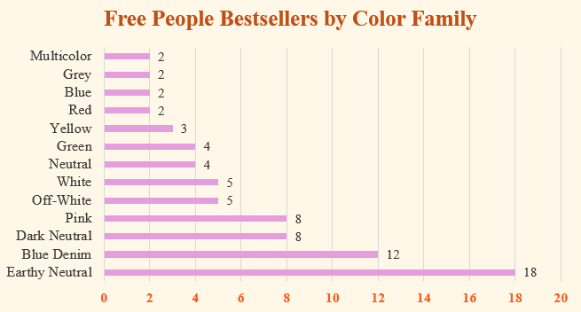
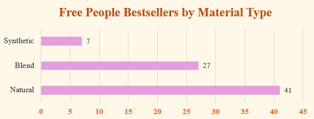
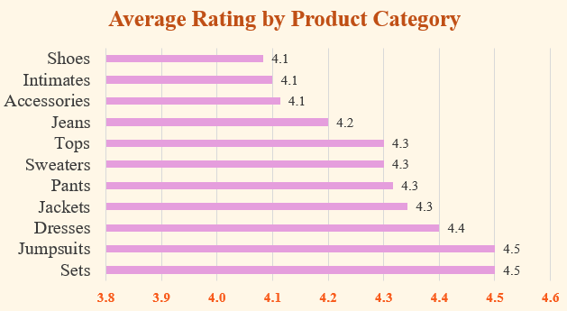

# Free People Bestsellers Product Analysis

This project analyzes 75 Free People bestseller products to identify patterns in product category, color family, material type, pricing, ratings, review count, and availability.

The goal was to determine which product features appeared most often among Free People bestsellers and what those patterns may suggest about customer demand, merchandising trends, and product performance.

## Tools Used

- Microsoft Excel
- Data cleaning
- Sorting and filtering
- XLOOKUP
- Pivot tables
- Pivot charts
- Dashboard-style chart organization

## Business Questions

- What product categories appeared most often among Free People bestseller products?
- What color families appeared most often among bestseller products?
- What material types appeared most often among bestseller products?
- What was the average price by product category?
- Which product categories had the highest average rating?
- Which product categories had the highest average review count?
- How did products compare when grouped into broader category groups such as Apparel, Accessories, and Footwear?

## Analysis

The dataset was cleaned and standardized across fields including:

- Product category
- Product subcategory
- Color family
- Primary color
- Fabric and material descriptions
- Material type
- Pattern and print
- Style and aesthetic
- Availability
- Product notes

A lookup table was created to group detailed product categories into broader merchandise groups such as Apparel, Accessories, and Footwear.

The cleaned data was then used to create pivot tables and charts analyzing:

- Product category counts
- Color family counts
- Material type counts
- Average price by product category
- Average rating by product category
- Average review count by product category
- Product count by broader category group

## Visualizations

### Product Category Distribution

### Color Family Distribution

### Material Type Distribution

### Average Price by Product Category

### Average Rating by Product Category

## Key Findings

- Pants were the most common product category in the sample, appearing 24 times among the 75 bestseller products.
- Accessories were the second most common category with 15 products, followed by tops with 11.
- Earthy Neutral was the most common color family, followed by Blue Denim. Dark Neutral and Pink were tied as the next most common color families.
- Pants appeared most often in Blue Denim rather than Earthy Neutral, suggesting that Earthy Neutral's overall popularity was distributed across multiple product categories.
- Natural materials appeared most often among the bestseller products, followed by blended materials. This suggests the assortment leaned toward materials associated with comfort, texture, and breathability while still including blends that may add stretch, durability, or easier care.
- Shoes had the highest average price among product categories, followed by jackets. Intimates had the lowest average price at $38.
- Sets and jumpsuits had the highest average ratings at 4.5, followed closely by dresses at 4.4.
- Most product categories had average ratings between 4.1 and 4.5, indicating generally strong customer ratings across the bestseller assortment.
- Sweaters had the highest average review count, followed by jeans and pants, suggesting stronger customer engagement in those categories.
- Apparel represented the largest share of the bestseller assortment with 54 products, compared with 15 accessories and 6 footwear products.

## Project Interpretation

The bestseller assortment was heavily concentrated in apparel, especially pants, tops, sweaters, jackets, and related clothing categories.

Earthy Neutral and Blue Denim were the most common color families, while natural and blended materials appeared more often than fully synthetic materials. Pricing varied considerably by category, with shoes and jackets positioned at higher average prices and intimates and tops at lower average prices.

Ratings were generally positive across categories, although categories with fewer reviews should be interpreted more carefully because small review counts can make average ratings less representative.

## File

- `Free_People_Bestsellers_Analysis.xlsx` — Excel workbook containing the cleaned dataset, pivot tables, charts, and analysis

To explore the workbook in detail, download the `.xlsx` file and open it in Excel.

## Project Goal

The goal of this project was to use Excel to organize e-commerce product data, identify recurring merchandising patterns, and translate raw product information into insights that could support merchandising, e-commerce, and marketing decisions.
